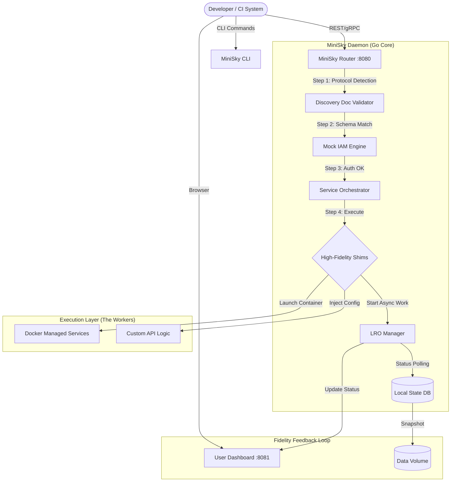

# MiniSky High-Fidelity Architecture Design

## 1. High-Level Overview
MiniSky is a **high-fidelity** local development environment for Google Cloud Platform (GCP). Unlike simple mock servers, MiniSky prioritizes **API correctness** and **behavioral parity**. It consists of a Go-based Daemon that validates all requests against GCP Discovery Documents and simulates complex cloud behaviors like long-running operations and stateful resource lifecycles.

### Key Architectural Pillars:
- **Contract-First Validation:** Uses official GCP Discovery Documents to ensure request/response schemas match the real cloud exactly.
- **Long-Running Operations (LRO):** Supports asynchronous behavior simulation (`PENDING` -> `RUNNING` -> `DONE`) for tools like Terraform.
- **Mock IAM Engine:** Simulates RBAC permission checks to catch security configuration errors locally.
- **Lazy Loading & Persistence:** Services are spun up on-demand and state is persisted to local disk.

---

## 2. System Architecture Diagram

---

## 3. Component Details

### A. The MiniSky Router & Validator
The gateway for all incoming traffic.
- **Protocol Detection:** Intercepts HTTP/gRPC.
- **Contract Validation:** Every request is strictly validated against a local registry of **GCP Discovery Documents**. If a field or type is incorrect, the router returns a standard `v1.Status` error formatted exactly like GCP.

### B. Long-Running Operations (LRO) Manager
A central engine for managing asynchronous tasks. 
- When an "affecting" request comes in (e.g., `clusters.create`), MiniSky returns a `google.longrunning.Operation` instead of the resource itself.
- **Fidelity Hook:** Allows users to simulate real cloud latencies or "Stuck Operations" to test their error handling and retry logic.

### C. Mock IAM Policy Engine
Simulates Identity and Access Management.
- Every request carries a "Local Identity."
- The engine checks permissions for the specific resource action (e.g., `compute.instances.create`).
- Ensures that developers catch missing permissions locally before deploying to real cloud environments.

### C. The BigQuery-DuckDB Shim
Since BigQuery does not have a official local emulator, MiniSky includes a custom shim:
- **Frontend:** Mimics the BigQuery REST API (Jobs, Datasets, Tables endpoints).
- **Backend:** Uses **DuckDB** for SQL execution. DuckDB's support for nested types and Parquet makes it highly compatible with BigQuery's data model.

### D. Infrastructure Shims (The Core Innovation)
For services that lack official emulators, MiniSky provides "Shims":
- **GCE-Shim:** Decodes Compute Engine API calls and translates them into Docker lifecycle events. It creates persistent containers that mirror VM behavior.
- **GKE-Shim:** Bridges the GKE Cluster API with local Kubernetes providers like **Kind** or **Minikube**.
- **VPC-Shim:** Manages sophisticated Docker Bridge networks, mapping GCP subnets and firewall rules to local network namespaces.

### E. Native Database Layer
For Cloud SQL, MiniSky orchestrates standard Postgres, MySQL, and SQL Server containers. The Router handles port mapping and secure connection simulation.

### G. Dataproc Job-to-Container Shim
MiniSky handles Dataproc jobs by mapping them to local Spark containers. It automatically configures the **GCS Connector** to point at the local MiniSky Storage emulator, enabling seamless `gs://` data processing without cloud dependencies.

### F. GCE Metadata Service
A dedicated internal server running at `169.254.169.254` within the local network to provide instance-specific metadata (Identity, Project ID, Attributes) to the emulated VMs.

---

## 4. Lazy Loading & "First-Hit" Discovery
1. **Request Received:** Router receives a request for `compute.googleapis.com`.
2. **Check Registry:** Router identifies this as a "Shim" service.
3. **Trigger Initialization:** ServiceManager ensures the Docker-based virtualization layer is ready.
4. **Proxy Forwarding:** Request is handled by the GCE-Shim, which might start a new "Instance" container if the user's Terraform requested one.
5. **Auto-Sleep:** (Optional) If no requests are received for $X$ minutes, the ServiceManager stops the container to save resources.

---

## 5. User Dashboard
The dashboard is a React-based SPA served by the Daemon. It mimics the **GCP Console** experience:
- **Service Activation:** Enable/Disable services with a single click.
- **Resource Browser:** View local GCS buckets, Pub/Sub topics, and BigQuery tables.
- **Log Viewer:** Aggregate logs from all running emulators in one stream.
- **Terraform Terminal:** A built-in helper to generate Terraform provider overrides.
