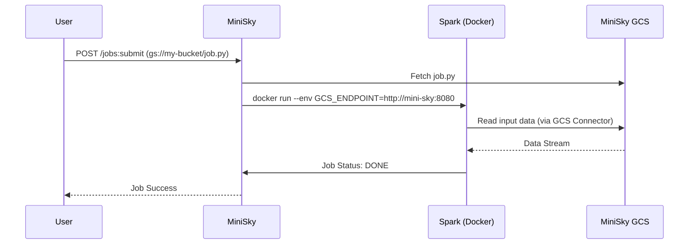

# Dataproc Integration Strategy for MiniSky

Dataproc is a managed Apache Spark and Hadoop service. Since running a full Hadoop cluster locally is resource-intensive, MiniSky uses a **Job-to-Container Mapping** strategy to emulate Dataproc.

## 1. Architectural Approach

### API Virtualization (The High-Fidelity Shim)
MiniSky implements the `dataproc.v1` REST API, specifically focusing on the `jobs` and `clusters` controllers using **Discovery Doc Schema Validation**.
- **Port:** `8080` (Multiplexed via the MiniSky Router).
- **Endpoint:** `dataproc.googleapis.com`.
- **LRO Integration:** All cluster and job lifecycle events are registered with the central **LRO Manager**, allowing Terraform to poll for completion.

### Execution Model: Spark-in-Docker
When a job is submitted via `jobs.submit`, MiniSky does not boot a complex multi-node cluster by default. Instead:
1. **Fetch Code:** If the job points to a `gs://` URI, MiniSky downloads the code from its internal GCS emulator.
2. **Container Launch:** MiniSky launches a specialized Spark container (e.g., `bitnami/spark`) configured in local mode.
3. **Connector Injection:** MiniSky automatically injects the **Google Cloud Storage Connector** JAR into the Spark environment.
4. **Endpoint Redirection:** The connector is pre-configured to point all `gs://` requests back to the MiniSky Router (`http://localhost:8080`).

---

## 2. Supported API Operations

| Operation | MiniSky High-Fidelity Implementation |
| :--- | :--- |
| `clusters.create` | Validates schema -> Checks IAM -> Registers **Operation** -> Launches Spark Master. |
| `jobs.submit` | Fetches code -> Registers **Operation** -> Triggers Docker Spark run. |
| `jobs.get` | Returns fully typed Job metadata with high-fidelity status (RUNNING, DONE). |
| `jobs.delete` | Gracefully terminates containers and updates LRO status. |

---

## 3. High-Fidelity GCS Integration
The "Killer Feature" of Dataproc in MiniSky is its awareness of other local services.



---

## 4. Resource Optimization
Since Dataproc clusters are heavy, MiniSky implements **Lazy Clusters**:
- The "Cluster" is only a logical entry in the database until a job is submitted.
- Heavy Spark dependencies are only pulled from the Docker registry when the first Dataproc job is received.

## 5. Usage in Terraform

```hcl
resource "google_dataproc_cluster" "local_cluster" {
  name   = "my-local-cluster"
  region = "us-central1"
}

resource "google_dataproc_job" "spark_job" {
  region       = google_dataproc_cluster.local_cluster.region
  force_delete = true
  placement {
    cluster_name = google_dataproc_cluster.local_cluster.name
  }
  pyspark_job {
    main_python_file_uri = "gs://my-bucket/process.py"
  }
}
```
*Note: Ensure the `dataproc_custom_endpoint` is set to `http://localhost:8080/dataproc/` in your provider.*
