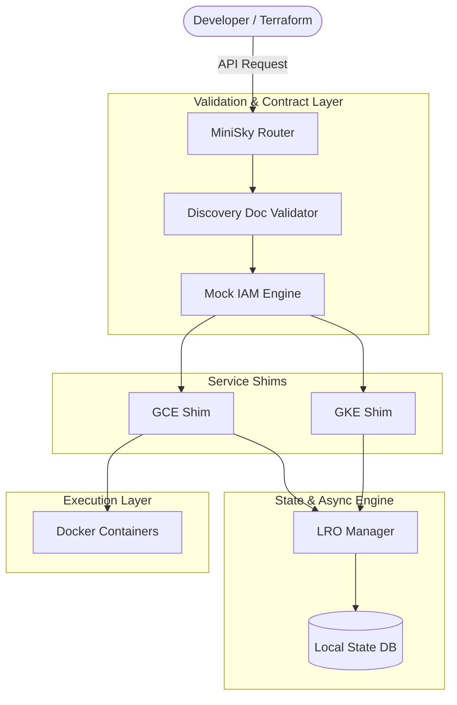

# High-Fidelity Design for MiniSky

Transitioning to a **High-Fidelity approach** significantly increases the complexity of MiniSky's internal architecture. It shifts the project from a "collection of mocks" to a "validated cloud simulation environment."

## 1. Key Shifts in Architecture

### A. Discovery-Driven Validation
In a medium-fidelity design, we might only validate the fields we care about. In **High-Fidelity**, every request is validated against the official **GCP Discovery Documents (JSON)**.
- **Impact:** We introduce a `ContractMiddleware` in the Router. If a request contains a field that doesn't exist in the GCP API, or if a type is wrong, MiniSky will reject it with the exact same error message as real GCP.

### B. Long-Running Operations (LRO) Engine
Many GCP actions (creating a VM, cluster, or BigQuery job) are asynchronous. High-fidelity means we cannot return a "DONE" status immediately.
- **Impact:** We implement a global **LRO Manager**. When a user calls `instances.insert`, the API returns a `v1.Operation` object. The user must then poll `/projects/{p}/regions/{r}/operations/{id}` to see it transition from `PENDING` -> `RUNNING` -> `DONE`.

### C. Stateful Lifecycle Simulation
Resources must have realistic life cycles.
- **Impact:** A VM isn't just "Running" or "Down." It must transition through `PROVISIONING` and `STAGING`. This allows developers to test their own code's robust handling of these intermediate states.

### D. Mock IAM & Permission Persistence
High-fidelity requires that "Permission Denied" errors locally are meaningful.
- **Impact:** Every request must be checked against a **Mock IAM Policy Engine**. If the dummy credential doesn't have the `storage.buckets.create` permission, the request fails. This prevents "surprises" when moving from local to production.

---

## 2. Updated Architecture Diagram (High-Fidelity)

---

## 3. Comparison of Approaches

| Feature | Medium Fidelity (Current) | High Fidelity (Proposed) |
| :--- | :--- | :--- |
| **Input Validation** | Loose (ignore unknown fields) | Strict (GCP Schema Match) |
| **Creation Latency**| Instant (returns 200) | Async (returns Operation/LRO) |
| **Error Format** | Generic JSON | `google.rpc.Status` (Fully Typed) |
| **IAM** | Always Allowed | Policy-Checked |
| **Consistency** | Strong (Immediate) | Configurable (Delayed) |

## 4. Why choose High-Fidelity?
1. **Terraform Reliability:** Terraform expects LROs and specific error codes. Without them, it often enters a "failed state" even if the resource was created.
2. **Race Condition Testing:** Allows developers to test how their app handles resources that are "Creating" but not yet "Ready."
3. **Security Testing:** Catch missing IAM permissions early in the dev cycle.
