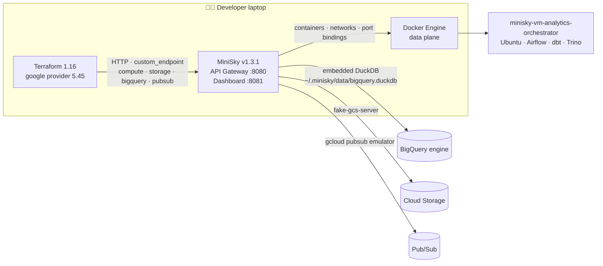
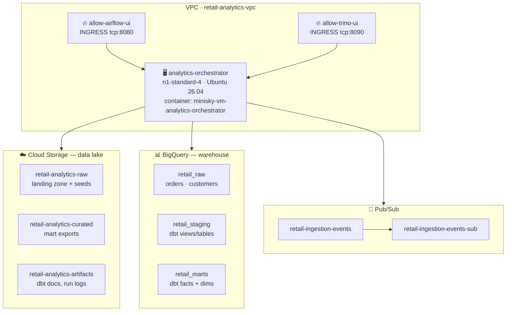
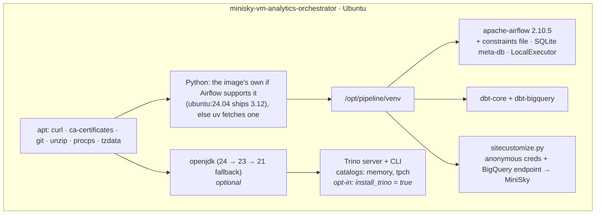
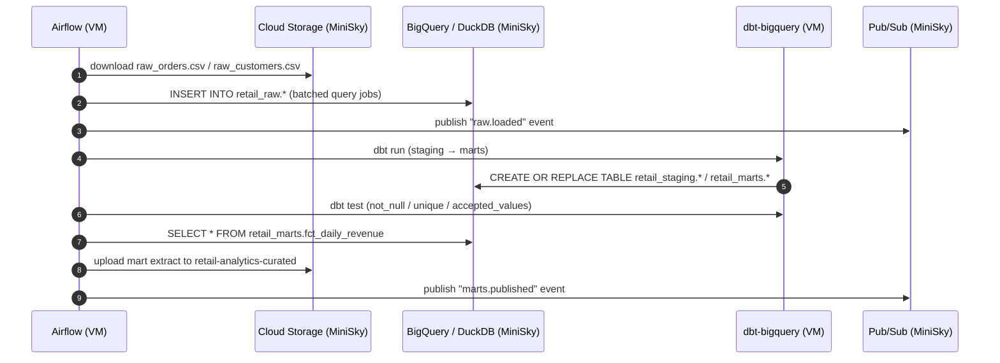
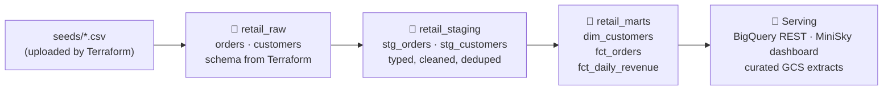
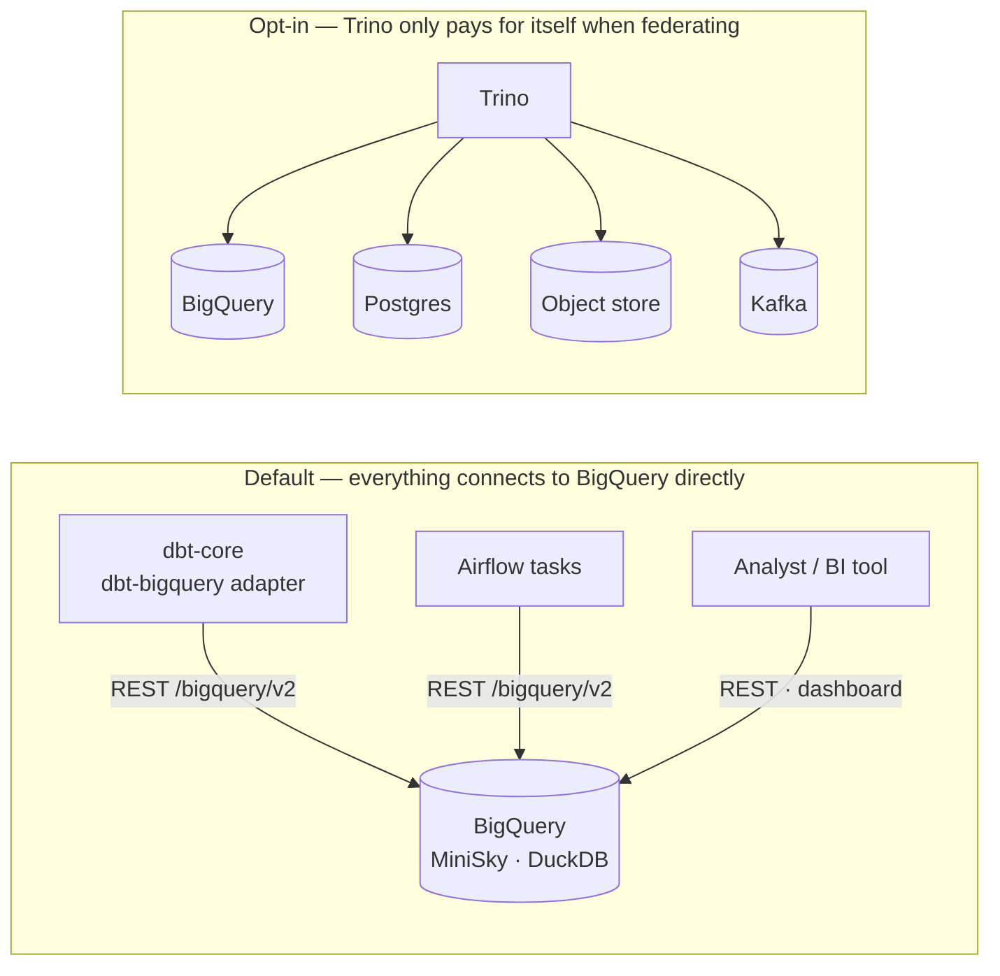

# Architecture — Local Analytics Engineering Pipeline on MiniSky

Every box below runs on the developer's laptop. No GCP project, no billing account, no network
egress to Google. MiniSky serves the Google Cloud REST APIs on `localhost:8080`; Terraform, dbt,
Airflow and the Python clients all believe they are talking to Google.

## 1. System context

## 2. Provisioned infrastructure (what Terraform owns)

Ordering constraint enforced in `compute.tf`: **firewall rules are created before the VM**.
MiniSky binds container ports at container-create time, so a firewall rule added after the VM
exists forces a tear-down/re-provision of that VM — which would wipe the software installed on it.
`google_compute_instance.orchestrator` therefore carries an explicit `depends_on` for both rules.

## 3. Software installed on the VM OS (what Terraform provisions)

`terraform_data.install_stack` runs `scripts/install_stack.sh`, which drives the install with
`docker exec` against the container MiniSky created for the VM. Re-running `terraform apply` only
re-installs when the script or its inputs change (hash-based `triggers_replace`).

> **Why `docker exec` and not a `metadata.startup-script`?**
> MiniSky v1.3.1 stores instance metadata faithfully but its compute shim boots the VM container
> with `tail -f /dev/null` and never executes `startup-script` (`pkg/shims/compute/api.go:508`).
> There is also no SSH daemon in the VM image, so `remote-exec` has nothing to connect to.
> `docker exec` is the honest local equivalent of the GCE guest agent, and it keeps the whole
> install inside the Terraform graph. See [FIDELITY-NOTES.md](FIDELITY-NOTES.md).

## 4. Runtime data flow (the Airflow DAG)

## 5. Layered model (medallion)

## 6. Component ownership

| Layer | Tool | Provisioned by | Runs where |
|-------|------|----------------|-----------|
| Infrastructure | Terraform | you | laptop → MiniSky API |
| Emulated GCP | MiniSky v1.3.1 | `minisky start` | laptop (Go binary + Docker) |
| Compute host | GCE VM | `compute.tf` | Docker container |
| Orchestration | Airflow 2.10.5 | `provision.tf` | VM |
| Transformation | dbt-core + dbt-bigquery | `provision.tf` | VM |
| Warehouse | BigQuery (DuckDB) | `bigquery.tf` | MiniSky process |
| Lake | Cloud Storage (fake-gcs-server) | `storage.tf` | Docker container |
| Eventing | Pub/Sub (gcloud emulator) | `pubsub.tf` | Docker container |
| Interactive query | BigQuery REST / dashboard | — | MiniSky process |
| Federation (opt-in) | Trino | `provision.tf`, `install_trino = true` | VM |

## 7. Why there is no Trino in the default path

The original tool list included Presto/Trino, so the installer still supports it
(`install_trino = true`). It is off by default because nothing in this pipeline needs it:

* **dbt** speaks to BigQuery through the adapter plus MiniSky's endpoint override — a Trino
  hop would add latency and a second SQL dialect to translate through.
* **Airflow** tasks call the same REST APIs the adapter does.
* **Analysts** query BigQuery directly, or browse it in the MiniSky dashboard on `:8081`.
* Trino's `memory` catalog would hold a **duplicate** of the marts that has to be reloaded on
  every restart, and drags in a JDK plus a ~1GB server download.

Turn it on when the exercise is federation — one SQL endpoint over BigQuery *and* an operational
Postgres *and* files — which is the problem Trino actually solves.
